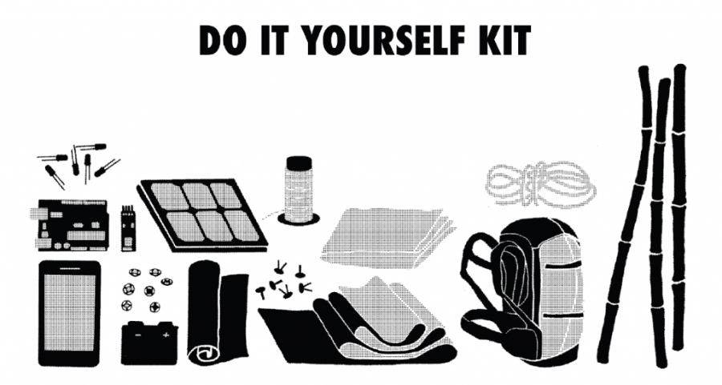
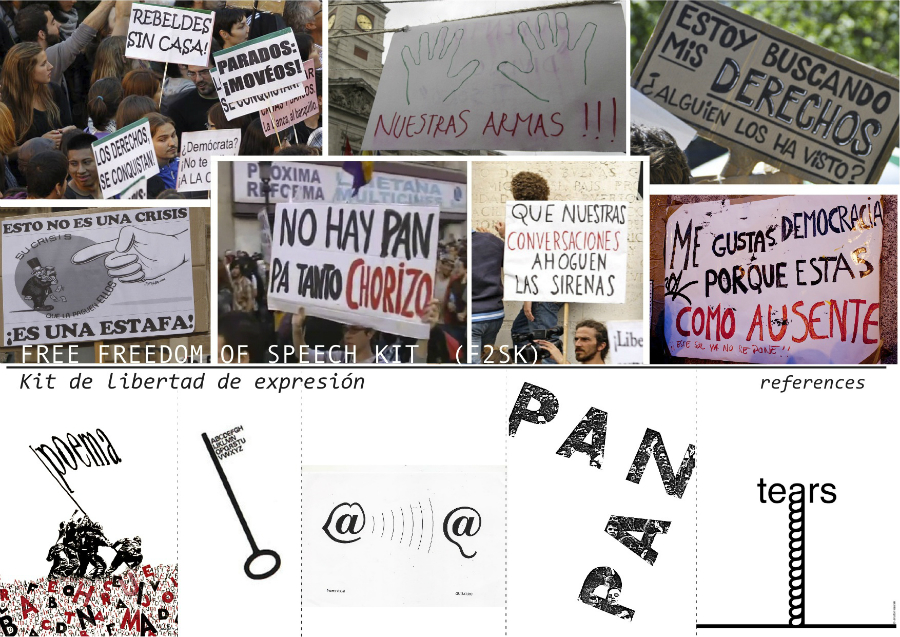
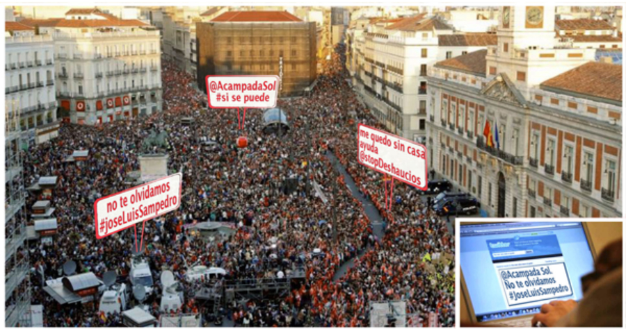
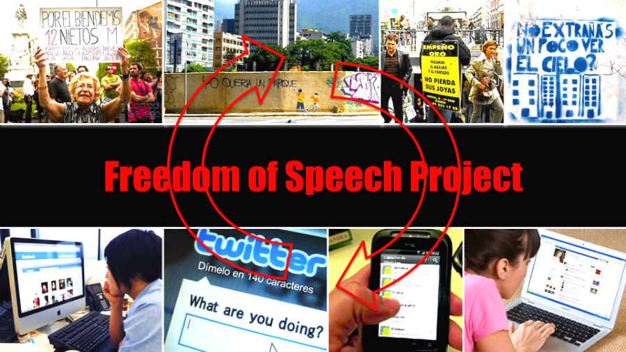

#Idea
## The kit (DIY)
The "Kit de Libertad de Expresión / Freedom of Speech Kit" consists of an electronic portable banner where a user can display messages either using a local physical interface, such as a keyboard, or a virtual one using social networks through internet. Likewise, there is a sort of online platform that allows writing messages and being sent and displayed on the banner.

The "Kit de Libertad de Expresión / Freedom of Speech Kit" is a portable visual display, connected to the internet, that receives and displays messages, enhancing citizens  to express their opinion during a collective demonstration. Hence it has to be light in weight, energetically sufficient, visually appealing and connected to the world. 

Different entry interfaces are provided: a physical one, so anyone close to the banner can write and display messages on it, and another one via internet, thus anyone in the world, using their cell phone, computer or other any device connected to the internet can send messages to the banner as well.

The device is built with a series of textiles (both conductors and insulators of electricity) and LEDs, together with a microprocessor and communication modules. All software and hardware design have been documented, so anyone would be able to build their own kit (DIY).

## Context
The idea was born during one of many social demonstrations that happened the recent past years in Spain. We were bringing our handwritten banners, but once on the streets, new ideas for messages to display would come up to our minds. There is a lot of creativity in banner making:

http://vimeo.com/24176032

Then a simple idea started growing: promote accessibility and communication between cultures in collective manners; promote freedom of speech! 

Many relevant social movements have been sprouting through social networks, where one connects as individual to, later on, collectively gather on the public space. Hence the idea was to explore tools for providing a smoother transition between the individual use of social networks and the collective expression represented in the public space.

We would like to create a platform that provides accessibility to those who for any reason can not be on the street (physical challenge, illness, job restrictions, fear, etc) but want to join the community and share their opinions and ideas by sending a message through it.

So far, neither Facebook, Twitter or any social networks solve that. It is a paradox, because even though they are social, their users produce and consume content on them individually. They are collective channels, but their access devices are individual.

The "Kit de Libertad de Expresión" it's a platform producing and displaying content in a collective environment, that could as well be supported by those communication channels. We would like to explore two features that social networks still have not settled: the actual collectivity (in a shared place and time) and its interaction with the public space.

