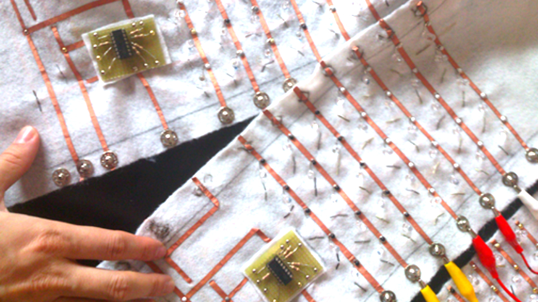
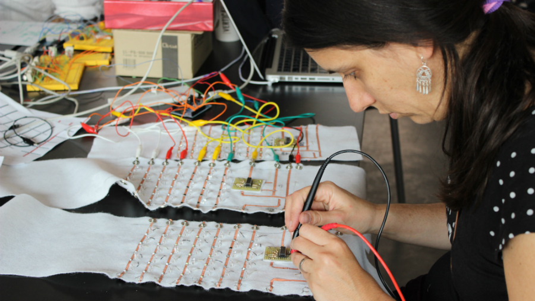
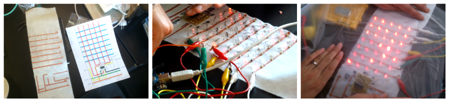
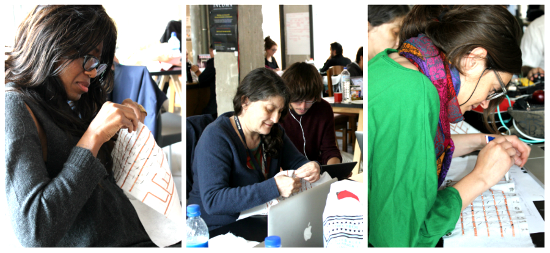
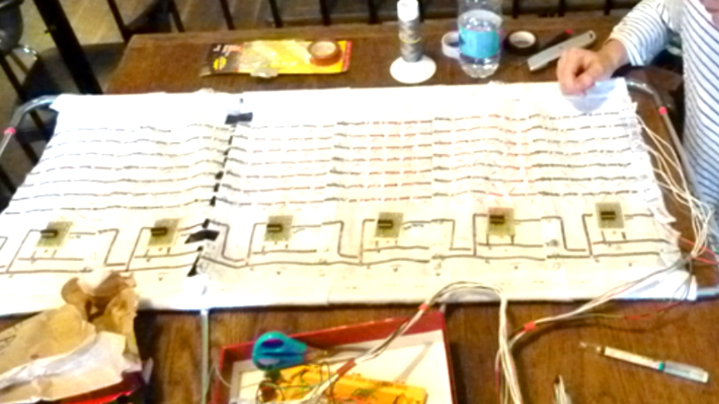

# Digital textiles
## The visual display structure
The KLE comprises a control board, a visual display, a communication device, an input interface, an energy source and a support structure. 

The visual display is made on fabric with sewn LED's that can display characters. Each character is independent, which provides modularity. This allows to create visual displays of arbitrary size and resolution depending on the number of characters attached.

This system is connected through mobile networks to the net creating a bidirectional communication between the physical environment and the virtual space of the internet. As an input device we propose from simple keyboards to mobile platforms like phones or tablets. The energy source is as simply as a battery feed by solar cells or a generator attached to a bike. We intend the KLE to be energetically autonomous and self sufficient. 

## Soft Hardware: sew, glue and connect
Each banner character is identical (except the first one on a row). The character is created glueing copper fabric to a non-conductive textile, sewing LEDs and pins with a conductive thread. The pins are used to connect character modules to each other, building a larger banner.

