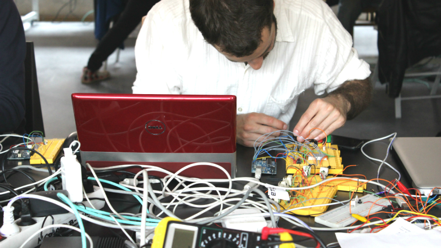
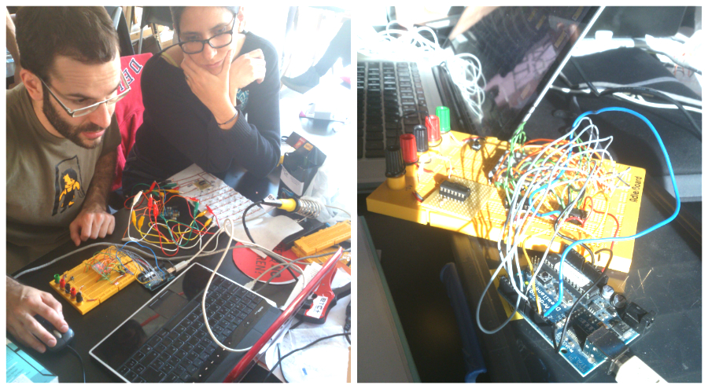

# Arduino
## Display messages
In order to display messages, several character modules are attached. Using shift registers chips, the characters to be displayed are animated. An Arduino code controls the timings, delays and messages to display.





## Code example
```
#include <Arduino.h>
#include "definitions.h"
#include "utils.h"
#include "bluetooth.h"

void setup(){
   /// ARDUINO PINS SETUP
   Serial.begin(9600);
   //Ponemos del pin 2 al 12 como salidas
   for (int i=2; i<=8; i++){
       pinMode(i, OUTPUT);
   }//for i
   pinMode(pinDatos, OUTPUT);
   pinMode(pinReloj, OUTPUT);
   pinMode(ledPin, OUTPUT);
   pinMode(pinBoton, INPUT);

   /// INITIAL MATRIX SETUP
   for (int i=0; i<7; i++){
       if(b_mode_cloth)digitalWrite(iArray_pins_filas[i], LOW); //APAGA TODAS LAS FILAS
       else digitalWrite(iArray_pins_filas[i], HIGH);//APAGA TODAS LAS FILAS
   }//for i;

   /// TRANSLATE CHARACTERS
   createAsciiArray();
   createPhraseArray();

   i_tTimeCounterForLetra = 0;
}//setup;
```