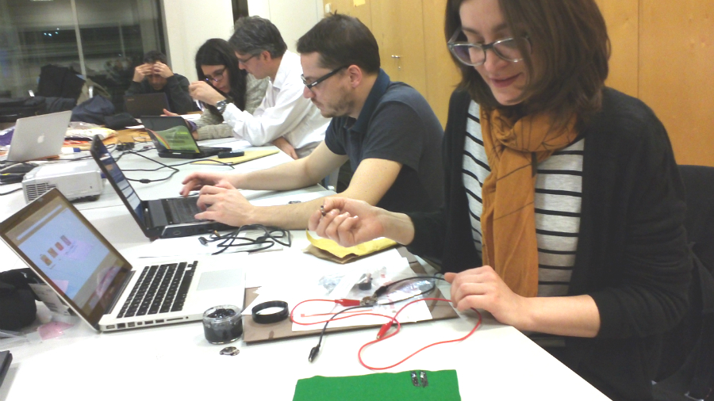
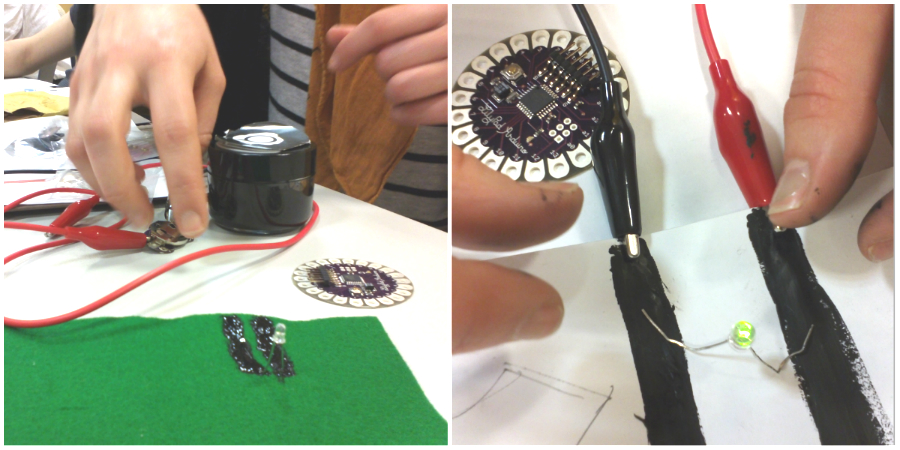
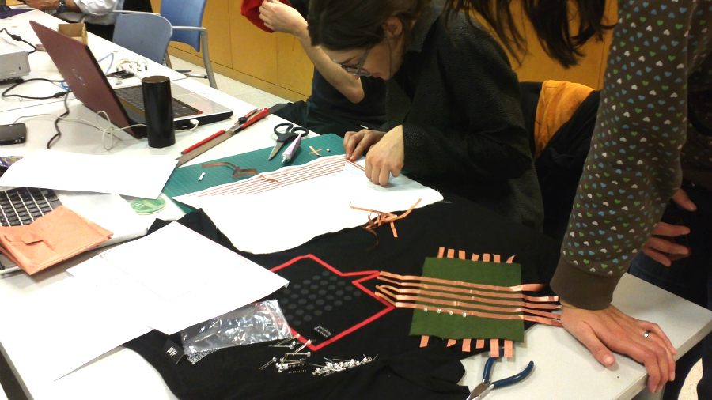
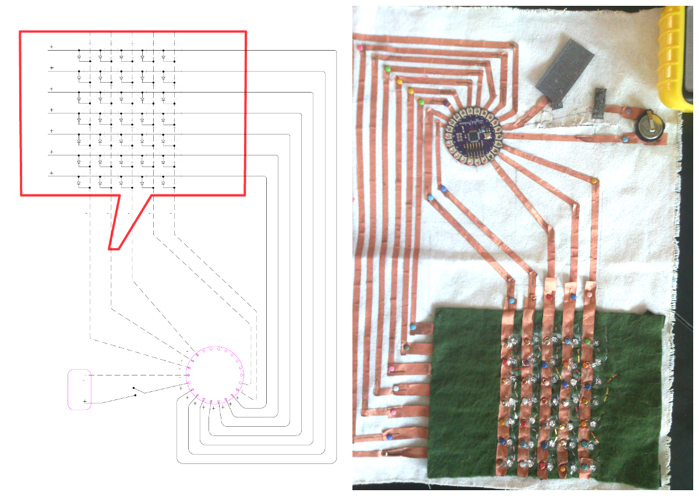
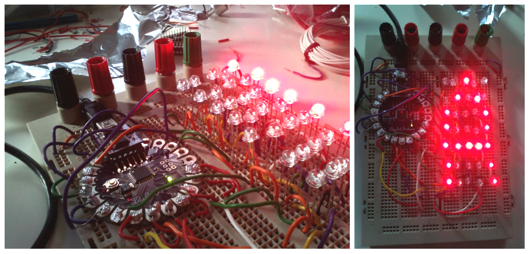

# Characters
## Materials & Lilypad
The first step was to develop a low cost characters display. We did some materials research including textiles, conductive ink, conductive sewing materials, non-conducting glue and textiles, etc.

A small piece of code was developed to test the 1 character LED display using Arduino Lilypad.








## Code example
```
//Pin connected to COL4
int col4Pin = 13;
//Pin connected to COL5
int col5Pin = 12;

int delayms = 5;
int delaymsBetweenLetters = 1000;

boolean col1RowsValues[7] = {LOW, LOW, LOW, LOW, LOW, LOW, LOW}; // LOW == false | HIGH == true
boolean col2RowsValues[7] = {LOW, LOW, LOW, LOW, LOW, LOW, LOW};

//char FRASE[] = "1";
char FRASE[] = "KIT LIBERTAD EXPRESION";
int countCharFrase = 0;

void setup() {
  //Start Serial for debuging purposes	
  Serial.begin(9600);
  //set pins to output because they are addressed in the main loop
  pinMode(col1Pin, OUTPUT);
  pinMode(col2Pin, OUTPUT);
```