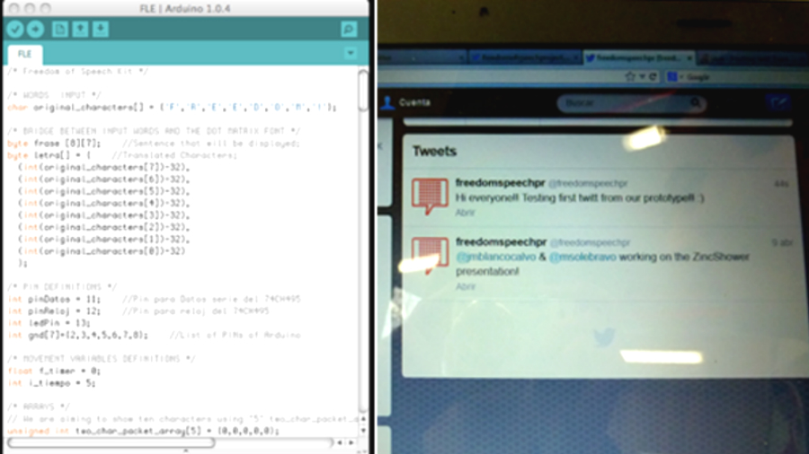

# Android app
## Sending remote messages
A custom Android application for "Kit de Libertad de Expresión / Freedom of Speech Kit" manages the messages sent to the banner by the users. Either via bluetooth or using twitter API the app wraps the messages and sends them to the physical banner to be displayed.




## Code smaple
```
	private EditText tweetEditor;
	private Button postButton;
	private Button sendBTMentionButton;
	TextView tv0;
	TextView tv1;

	BluetoothAdapter mBluetoothAdapter = BluetoothAdapter.getDefaultAdapter();
	BluetoothSocket mBluetoothSocket;
	BluetoothDevice mBluetoothDevice;
	private static final int REQUEST_ENABLE_BT = 2;

	InputStream mmInStream = null;
	OutputStream mmOutStream = null;

	ArrayAdapter<String> mArrayAdapter;
	public String Mention;
	
	final Handler mHandler = new Handler();
```
