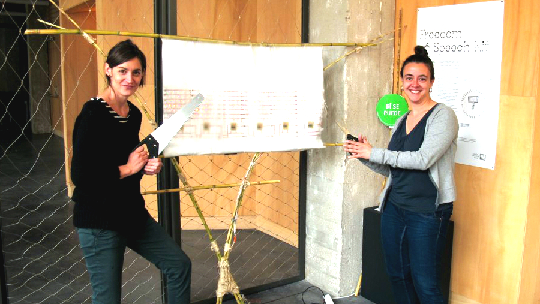
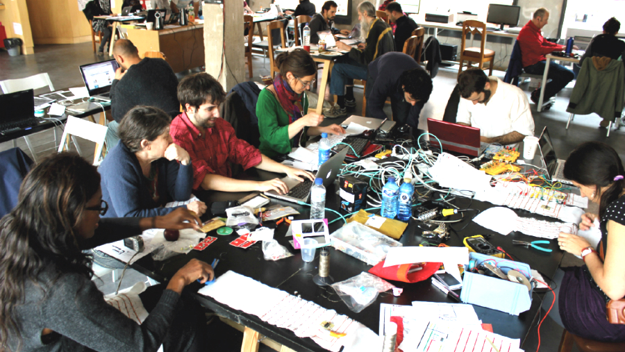
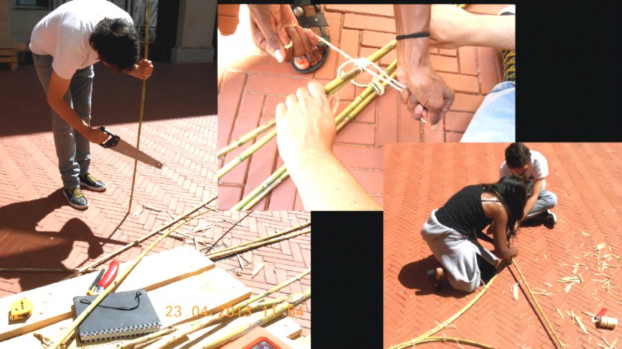
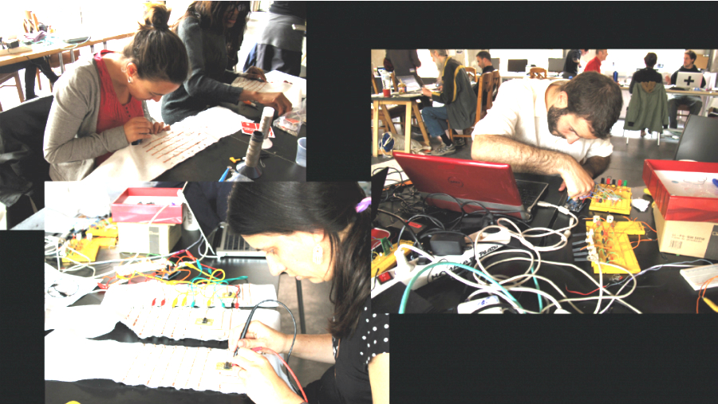

# First Prototype
The first prototype of "Kit de Libertad de Expresión / Freedom of Speech Kit" was developed at Medialab Prado Madrid during Interactivos?'13 with a great team of collaborators (Quique, Rafael, Dani, Carlos, Sonia, Gonzalo, Andrea, Echedey, Soraya, Eva and many others) and the project promotor team (Anna Carreras, Chema Blanco and Maria Solé Bravo). 

It's a full working prototype with 6 LED characters hold by a bamboo light structure. This prototype is connected via bluetooth to mobile phones which can already tweet messages to it.

There is still a long way to go, developing a more robust structure - i.e: resistant to different weather conditions-, making the platform more accessible through different interfaces or creating the web community tools to let several KLE's communicate among them.

