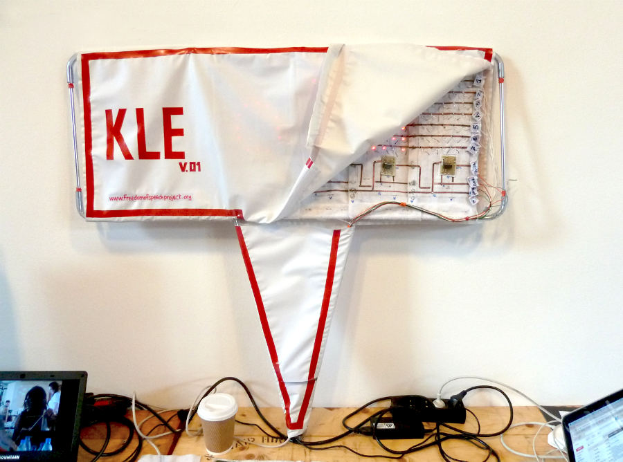
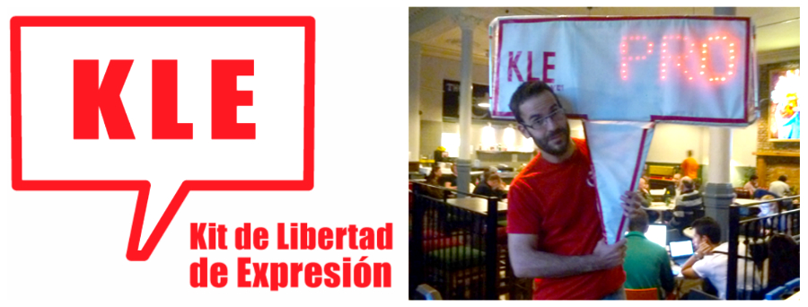

# Second Prototype
The second prototype was developed for the AND festival '13, Liverpool. It's a full working prototype with 6 LED characters held by a low cost aluminium light structure (the structure of a tent). The new light diffusing material improved the reading and understanding of the messages.

## Future
Further steps include creating an appropriate web service where anyone who builds a "Kit de Libertad de Expresión / Freedom of Speech Kit" can register and geo-localize his or her own device. Therefore, anyone in the world, through this service, can choose whether to send his/her messages to a device placed in private premises (e.g.: museums) or public spaces (e.g.: squares). Further research about low cost materials and an efficient energy power supply for the "Kit de Libertad de Expresión" would allow us to improve its portability and autonomy.

## Workshop & Expo
A 5 days workshop could let participants to build different "Kits de Libertad de Expresión / Freedom of Speech Kits" using and exploring different materials. The result of the workshop can be then showcased in an art gallery where visitors and remote users can send in real time messages to the different KLE's banners.
