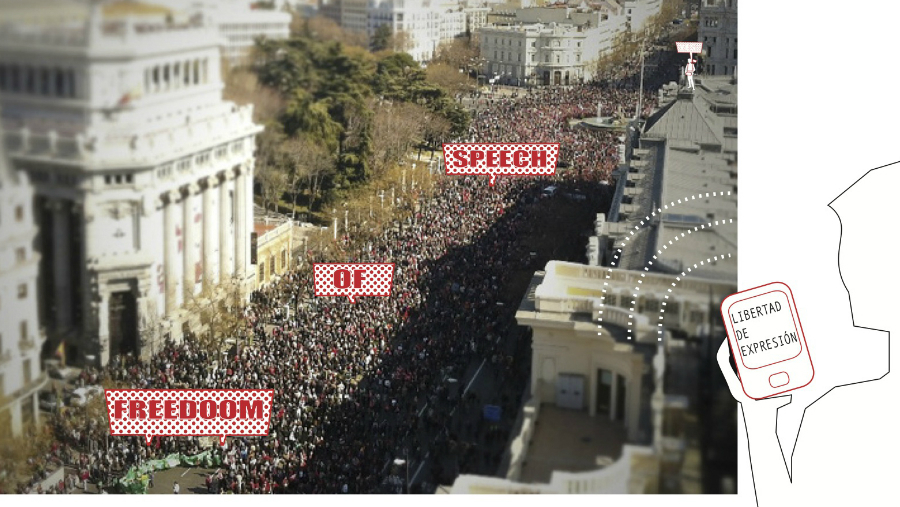

# Project Title
Kit de Libertad de Expresión / Freedom of Speech Kit

## Authors
- Anna Carreras www.github.com/acarreras, www.etcinventions.com, www.annacarreras.com
- Chema Blanco www.github.com/chemabc, www.etcinventions.com, www.jmblancocalvo.com
- Maria Solé Bravo www.mariasolebravo.com

## Description
The "Kit de Libertad de Expresión  / Freedom of Speech Kit" is  an interactive and portable banner where people can send messages in real time to express their claims during a social demonstration.
Lately, many collective demonstrations have been organized through social networks where people interact individually (from their computers, mobile phones,...) in the pursue of a common goal . The "Kit de Libertad de Expresión" it's a social placard which reduces the gap between the use of social networks for citizens organization and the collective expression of ideas in a demonstration.

