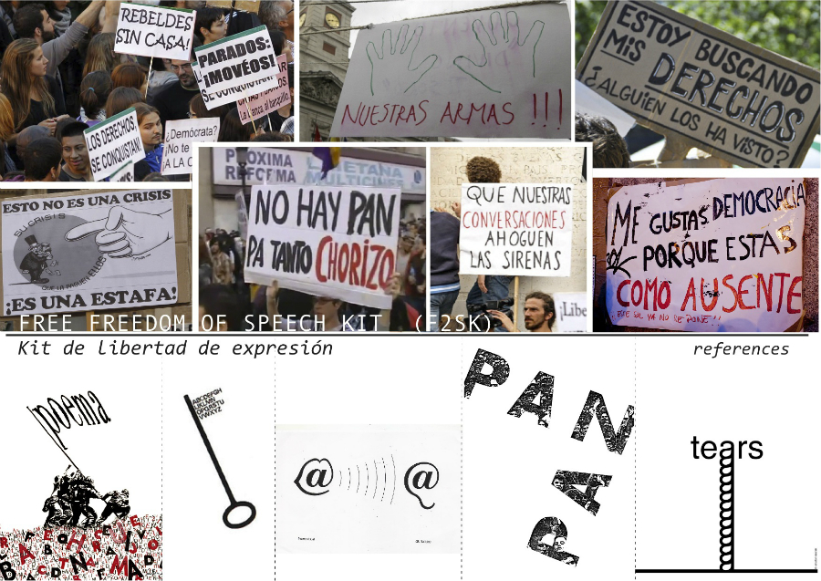
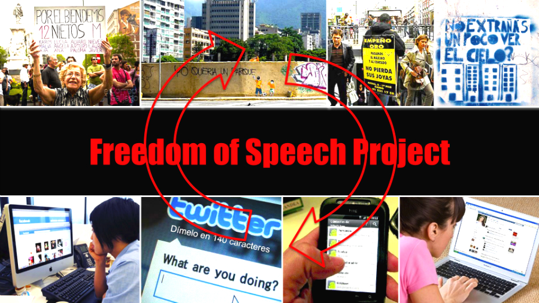
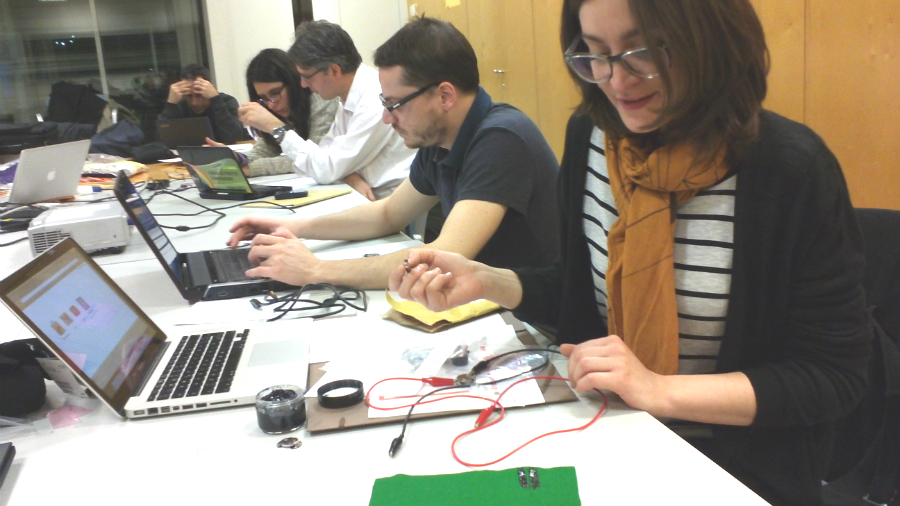
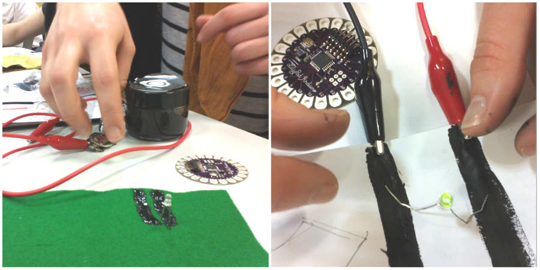
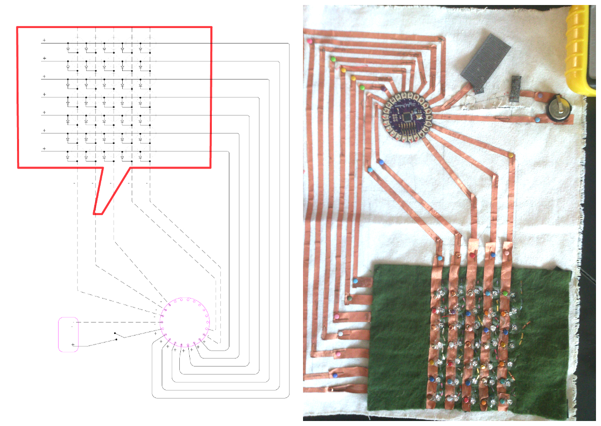
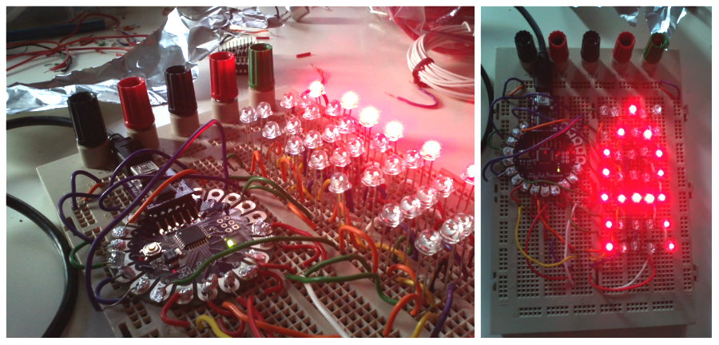
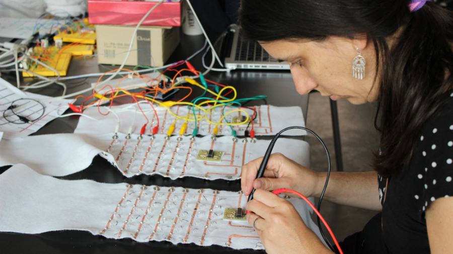
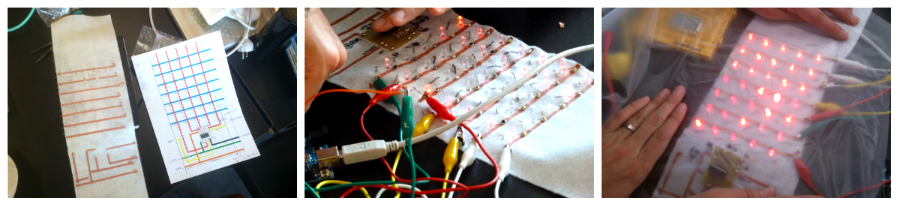
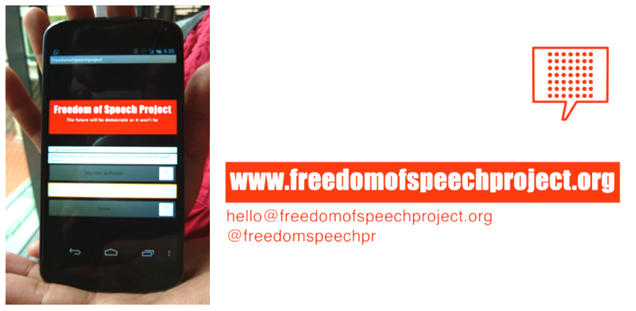

# Kit de Libertad de Expresión / Freedom of Speech Kit
## Authors
- Anna Carreras www.github.com/acarreras
- Chema Blanco www.github.com/chemabc
- Maria Solé Bravo www.mariasolebravo.com

## Description
The "Kit de Libertad de Expresión / Freedom of Speech Kit" is  an interactive and portable banner where people can send messages in real time to express their claims during a social demonstration.
Lately, many collective demonstrations have been organized through social networks where people interact individually (from their computers, mobile phones,...) in the pursue of a common goal. The "Kit de Libertad de Expresión" it's a social placard which reduces the gap between the use of social networks for citizens' organization and the collective expression of ideas in a demonstration.


#Idea
## The kit (DIY)
The "Kit de Libertad de Expresión / Freedom of Speech Kit" consists of an electronic portable banner where a user can display messages either using a local physical interface, such as a keyboard, or a virtual one using social networks through internet. Likewise, there is a sort of online platform that allows writing messages and being sent and displayed on the banner.

The "Kit de Libertad de Expresión / Freedom of Speech Kit" is a portable visual display, connected to the internet, that receives and displays messages, enhancing citizens  to express their opinion during a collective demonstration. Hence it has to be light in weight, energetically sufficient, visually appealing and connected to the world. 

Different entry interfaces are provided: a physical one, so anyone close to the banner can write and display messages on it, and another one via internet, thus anyone in the world, using their cell phone, computer or other any device connected to the internet can send messages to the banner as well.

The device is built with a series of textiles (both conductors and insulators of electricity) and LEDs, together with a microprocessor and communication modules. All software and hardware design have been documented, so anyone would be able to build their own kit (DIY).


## Context
The idea was born during one of many social demonstrations that happened the recent past years in Spain. We were bringing our handwritten banners, but once on the streets, new ideas for messages to display would come up to our minds. There is a lot of creativity in banner making:



http://vimeo.com/24176032

Then a simple idea started growing: promote accessibility and communication between cultures in collective manners; promote freedom of speech! 

Many relevant social movements have been sprouting through social networks, where one connects as individual to, later on, collectively gather on the public space. Hence the idea was to explore tools for providing a smoother transition between the individual use of social networks and the collective expression represented in the public space.

We would like to create a platform that provides accessibility to those who for any reason can not be on the street (physical challenge, illness, job restrictions, fear, etc) but want to join the community and share their opinions and ideas by sending a message through it.

So far, neither Facebook, Twitter or any social networks solve that. It is a paradox, because even though they are social, their users produce and consume content on them individually. They are collective channels, but their access devices are individual.

The "Kit de Libertad de Expresión" it's a platform producing and displaying content in a collective environment, that could as well be supported by those communication channels. We would like to explore two features that social networks still have not settled: the actual collectivity (in a shared place and time) and its interaction with the public space.




# Characters
##Materials & Lilypad
The first step was to develop a low cost characters display. We did some research on materials, including textiles, conductive ink, conductive thread, non-conducting glue and textiles, etc.

A small piece of code was developed to test the 1 character LED display using Arduino Lilypad.








## Code example
```
//Pin connected to COL4
int col4Pin = 13;
//Pin connected to COL5
int col5Pin = 12;

int delayms = 5;
int delaymsBetweenLetters = 1000;

boolean col1RowsValues[7] = {LOW, LOW, LOW, LOW, LOW, LOW, LOW}; // LOW == false | HIGH == true
boolean col2RowsValues[7] = {LOW, LOW, LOW, LOW, LOW, LOW, LOW};

//char FRASE[] = "1";
char FRASE[] = "KIT LIBERTAD EXPRESION";
int countCharFrase = 0;

void setup() {
  //Start Serial for debuging purposes	
  Serial.begin(9600);
  //set pins to output because they are addressed in the main loop
  pinMode(col1Pin, OUTPUT);
  pinMode(col2Pin, OUTPUT);
```

# Digital textiles
## The visual display structure
The KLE comprises a control board, a visual display, a communication device, an input interface, an energy source and a support structure. 

The visual display is made on fabric with sewn LED's that can display characters. Each character is independent, which provides modularity. This allows to create visual displays of arbitrary size and resolution depending on the number of characters attached.




This system is connected through mobile networks to the net creating a bidirectional communication between the physical environment and the virtual space of the internet. As an input device we propose from simple keyboards to mobile platforms like phones or tablets. The energy source is as simply as a battery feed by solar cells or a generator attached to a bike. We intend the KLE to be energetically autonomous and self sufficient. 

## Soft Hardware: sew, glue and connect
Each banner character is identical (except the first one on a row). The character is created glueing copper fabric to a non-conductive textile, sewing LEDs and pins with a conductive thread. The pins are used to connect character modules to each other, building a larger banner.




# Arduino
## Display messages
In order to display messages, several character modules are attached. Using shift registers chips, the characters to be displayed are animated. An Arduino code controls the timings, delays and messages to display.


## Code example
```
#include <Arduino.h>
#include "definitions.h"
#include "utils.h"
#include "bluetooth.h"

void setup(){
   /// ARDUINO PINS SETUP
   Serial.begin(9600);
   //Ponemos del pin 2 al 12 como salidas
   for (int i=2; i<=8; i++){
       pinMode(i, OUTPUT);
   }//for i
   pinMode(pinDatos, OUTPUT);
   pinMode(pinReloj, OUTPUT);
   pinMode(ledPin, OUTPUT);
   pinMode(pinBoton, INPUT);

   /// INITIAL MATRIX SETUP
   for (int i=0; i<7; i++){
       if(b_mode_cloth)digitalWrite(iArray_pins_filas[i], LOW); //APAGA TODAS LAS FILAS
       else digitalWrite(iArray_pins_filas[i], HIGH);//APAGA TODAS LAS FILAS
   }//for i;

   /// TRANSLATE CHARACTERS
   createAsciiArray();
   createPhraseArray();

   i_tTimeCounterForLetra = 0;
}//setup;
```

# Android app
## Sending remote messages
A custom Android application for "Kit de Libertad de Expresión / Freedom of Speech Kit" manages the messages sent to the banner by the users. Either via bluetooth or using twitter API the app wraps the messages and sends them to the physical banner to be displayed.




## Code smaple
```
	private EditText tweetEditor;
	private Button postButton;
	private Button sendBTMentionButton;
	TextView tv0;
	TextView tv1;

	BluetoothAdapter mBluetoothAdapter = BluetoothAdapter.getDefaultAdapter();
	BluetoothSocket mBluetoothSocket;
	BluetoothDevice mBluetoothDevice;
	private static final int REQUEST_ENABLE_BT = 2;

	InputStream mmInStream = null;
	OutputStream mmOutStream = null;

	ArrayAdapter<String> mArrayAdapter;
	public String Mention;
	
	final Handler mHandler = new Handler();
```

# First Prototype
The first prototype of "Kit de Libertad de Expresión / Freedom of Speech Kit" was developed at Medialab Prado Madrid during Interactivos?'13 with a great team of collaborators (Quique, Rafael, Dani, Carlos, Sonia, Gonzalo, Andrea, Echedey, Soraya, Eva and many others). 

It's a full working prototype with 6 LED characters hold by a bamboo light structure. This prototype is connected via bluetooth to mobile phones which can already tweet messages to it.

There is still a long way to go, developing a more robust structure - i.e: resistant to different weather conditions-, making the platform more accessible through different interfaces or creating the web community tools to let several KLE's communicate among them.


# Second Prototype
The second prototype was developed for the AND festival '13, Liverpool. It's a full working prototype with 6 LED characters held by a low cost aluminium light structure (the structure of a tent). The new light diffusing material improved the reading and understanding of the messages.


## Future
Further steps include creating an appropriate web service where anyone who builds a "Kit de Libertad de Expresión / Freedom of Speech Kit" can register and geo-localize his or her own device. Therefore, anyone in the world, through this service, can choose whether to send his/her messages to a device placed in private premises (e.g.: museums) or public spaces (e.g.: squares). Further research about low cost materials and an efficient energy power supply for the "Kit de Libertad de Expresión" would allow us to improve its portability and autonomy.


## Workshop & Expo
A 5 days workshop could let participants to build different "Kits de Libertad de Expresión / Freedom of Speech Kits" using and exploring different materials. The result of the workshop can be then showcased in an art gallery where visitors and remote users can send in real time messages to the different KLE's banners.
